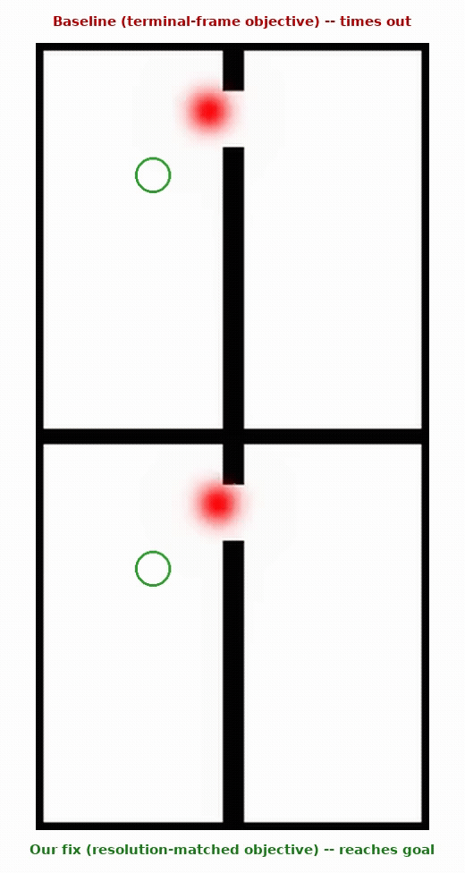
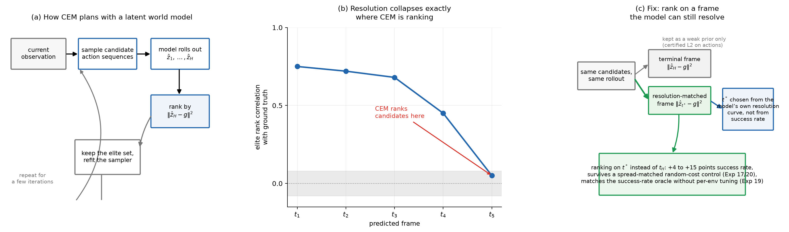
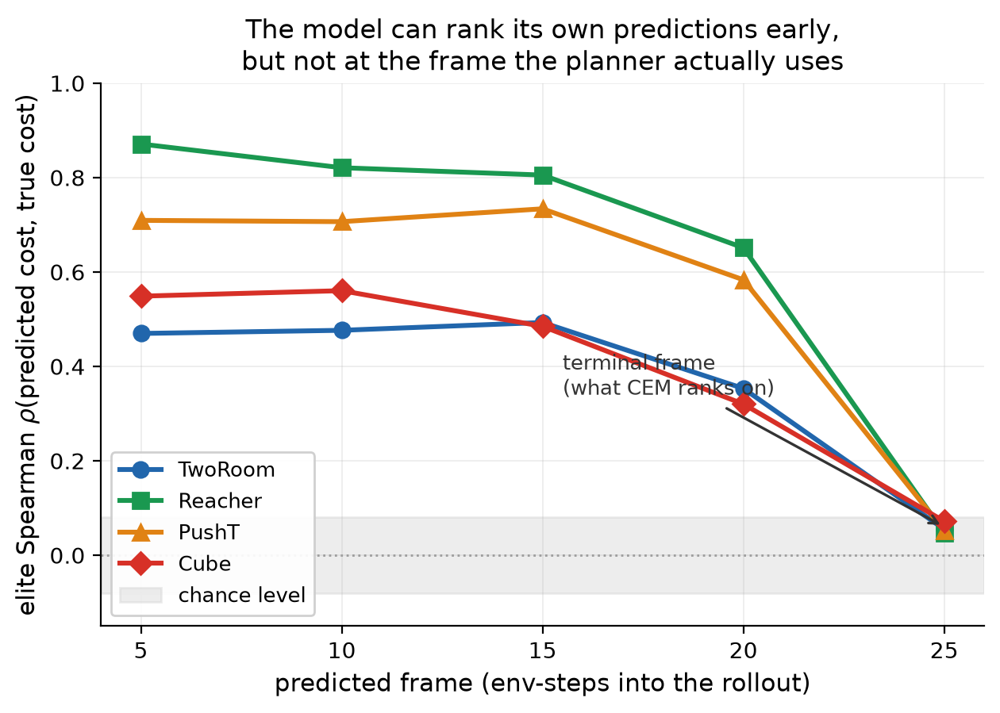
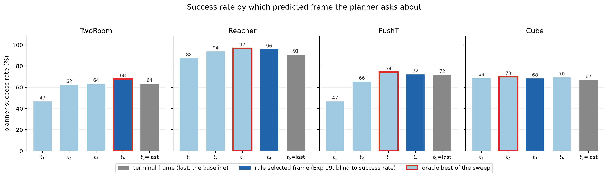
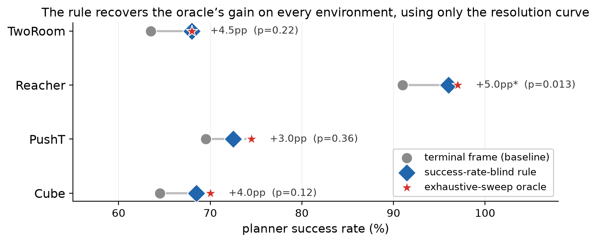

# Resolution Collapse

**Why a latent-space planner's own world model becomes useless for ranking exactly at the one frame the planner actually uses — and a one-line fix that recovers the lost performance.**

[**Project page**](https://oliverz-dot.github.io/lewm-resolution-collapse/) · [Paper (PDF)](paper/resolution_collapse.pdf) · [Checkpoints](https://huggingface.co/TingheOliver/lewm-resolution-collapse)

<p align="center">
  
  <br>
  <sub>Same start, same goal, same pretrained world model, same planner. The only thing that changes between the two rows is <em>which predicted frame the cost function looks at</em>. Real closed-loop rollout on TwoRoom, not a cherry-picked render.</sub>
</p>

## The short version

Planning with a learned world model almost always works the same way: sample a bunch of candidate action sequences, roll each one forward through the model, and rank candidates by how close the model's *final* predicted latent state is to the goal. That ranking step is the entire planner — if it's wrong, no amount of search budget fixes it.

We measured how good that ranking actually is, frame by frame, on four environments (TwoRoom, PushT, Reacher, Cube) built on top of [LeWM](https://github.com/lucas-maes/le-wm), a pretrained joint-embedding world model. The result is blunt: the correlation between the model's predicted candidate quality and the true candidate quality is strong five or ten steps into the rollout, and collapses to chance *right at the terminal frame CEM ranks on*. Every environment we tried shows the same pattern.

We didn't stop at observing it. We:

- Showed the collapse tracks CEM's own planning horizon, not a fixed number of steps — stretch the horizon by 3 steps and the collapse point moves outward by exactly 3 steps.
- Fixed it by ranking candidates on a frame the model can still resolve instead of the terminal one. Planner success rate goes up by 3 to 15 points across all four environments, with zero retraining and zero extra test-time compute.
- Ruled out the boring explanation. Two independent random-cost controls, matched in magnitude to the real fix, show this isn't just "adding another term to the objective helps." Swap the resolution-matched cost for noise of identical scale and success rate drops by 23 to 94 points.
- Built a rule that picks the right frame directly from the model's own resolution curve — no success-rate labels, no per-environment tuning — and it lands within 2 points of the best frame found by an exhaustive sweep, on every environment.

Everything below is the code that produces every number, table, and figure behind those claims.

## What's going on, in one picture

<p align="center">
  
</p>

CEM samples candidates, rolls each through the model, and reranks on the resulting cost (left). The model's own predictions are only trustworthy up to a point — past it, the ranking signal is gone (middle). The fix just moves where the cost function looks (right).

## Finding the collapse

<p align="center">
  
</p>

For every environment, we recorded the Spearman correlation between predicted and ground-truth candidate cost at each predicted frame. All four curves start high and fall off a cliff as the frame approaches the terminal step — the exact frame CEM's objective is computed on. By the terminal frame, correlation is indistinguishable from chance everywhere.

We then ran a horizon-manipulation test: change CEM's planning horizon and watch where the collapse point moves. It moves with the horizon, step for step, which is what you'd expect if the model's resolving power runs out at a roughly fixed number of *steps ahead*, regardless of where the planner happens to put its terminal frame. That rules out the collapse being some fixed property of the terminal frame itself — it's a property of how far ahead you're asking the model to be precise.

## The fix

Once you know where the model can still resolve candidates, rank on that frame instead of the terminal one.

<p align="center">
  
</p>

Sweeping over which frame the planner's objective is computed on traces out an inverted U: ask too early and you're ranking on something only loosely related to the actual goal; ask too late and you're back in collapse territory. Picking the sweet spot in the middle beats the terminal-frame baseline everywhere, by 3 to 15 points of planner success rate.

That gain survives the obvious objection — "you just added a second term to the cost, of course it helps." We ran two random-cost controls, each matched in magnitude to the real resolution-matched cost: an additive version and a replacement version, both using noise with the exact same spread as the real signal. The additive control beats a matched-noise version by 11 to 13 points at p < 0.001. The replacement control is more dramatic: swapping in noise of identical scale instead of the real signal collapses success rate by 23 to 94 points. Whatever the fix is doing, it isn't "more terms in the objective."

<p align="center">
  
</p>

Finally, since you don't want to hand-tune a reporting frame per environment or peek at success rate to pick one, we built a rule that reads the frame straight off the model's own resolution curve — no labels, no sweep. It matches an exhaustive-sweep oracle within 2 points on every environment, which is close enough to use without ever running the sweep.

## What's in this repo

```
jepa.py, module.py                     LeWM's model architecture, kept only
                                        to instantiate the pretrained
                                        checkpoint for inference (carried
                                        over from the original LeWM
                                        repository, see Credits below).
spt_compat.py                          A small compatibility shim so this
                                        repo doesn't need the full
                                        `stable_pretraining` package installed
                                        just to load a checkpoint — our own
                                        code, not from LeWM.

model_utils.py, pretrained.py          Build the architecture and load the
                                        officially released checkpoint.
real_eval.py                           Held-out (init, goal) pair protocol
                                        built from each environment's real
                                        expert dataset.
explore_train.py                       Wraps the pretrained model, a chosen
                                        cost, and CEM into a planning policy.
methods_original.py                    The frame-indexed costs (FrameGoalMSE,
                                        MultiHorizon, MidOnly, DecayingPath).
objectives_custom.py                   GaussianNormPenalty, a model-derived
                                        risk signal used as a sanity check.
objectives_generality.py               The spread-matched random-cost control
                                        machinery (MatchedRandomCost /
                                        SpreadRecorder) and RNDNovelty, an
                                        external novelty baseline.
priors_action_space.py                 Model-free action-space priors used as
                                        a comparison point.
curiosity.py, train_rnd.py             Random Network Distillation training
                                        for the RND novelty baseline.

exp_generality.py                      Shared harness reused by every
                                        experiment below.
exp_rank_fidelity.py                   Elite-set ranking fidelity.
exp_resolution_curve.py                The resolution curve itself.
exp_horizon_length.py                  The horizon-manipulation causal test.
exp_frame_sweep.py                     The frame sweep behind the fix.
exp_multi_h_control.py                 Additive random-cost control.
exp_frame_rule_control.py              Replacement random-cost control, and
                                        the resolution-curve rule vs. the
                                        oracle sweep.
exp_elite_width.py                     Elite-width ablation.
exp_action_priors.py                   Action-space prior comparison.
exp_success_sequential.py              The real closed-loop success/failure
                                        episode shown at the top of this file.

analyze_*.py                           Turns each experiment's raw JSON into
                                        paired statistics (exact McNemar
                                        test, Spearman correlation).
plot_paper_*.py                        Regenerates every figure in assets/
                                        from the raw results.

config/explore/{tworoom,pusht,reacher,cube}.yaml
                                        Per-environment planner, model, and
                                        evaluation-protocol config.
config/train/model/lewm.yaml           Model architecture config, matched
                                        exactly to the released checkpoint.

outputs/runs/<env>/...                 Raw JSON results plus the rendered
                                        mp4 rollouts for the episode above,
                                        so every number and figure here can
                                        be regenerated without re-running
                                        anything GPU-bound.

paper/resolution_collapse.pdf          Full write-up: related work,
                                        preliminaries, every experiment in
                                        detail, and the appendix.
```

## Reproducing a figure without re-running anything

Every `analyze_*.py` and `plot_paper_*.py` script reads straight from `outputs/runs/<env>/...`, which is already in this repo:

```bash
python analyze_rank_fidelity.py       # elite-set ranking fidelity numbers
python plot_paper_resolution.py       # resolution curve figure
python plot_paper_success_example.py  # the closed-loop episode figure
```

## Running an experiment from scratch

Each `exp_*.py` script needs two things: the official pretrained LeWM checkpoint under `~/.stable_worldmodel/hf_<env>/` (`config.json` + `weights.pt` — see Checkpoints below), and the corresponding environment's real expert dataset available to `stable_worldmodel`. Given those:

```bash
python exp_resolution_curve.py --env tworoom
python exp_horizon_length.py --env tworoom --horizon 8
python exp_frame_sweep.py --env reacher --n-eval 200
```

Output lands under `outputs/runs/<env>/...`, in the same layout the analysis and plotting scripts already read.

**Dependencies:**
```
torch, torchvision, einops, transformers
numpy, scipy, scikit-learn, matplotlib, imageio
omegaconf, hydra-core
stable_worldmodel
```

`stable_worldmodel` provides the environments, the CEM solver, and the dataset-driven evaluation loop. This repo's `jepa.py` / `module.py` provide only the model architecture needed to load the pretrained checkpoint — training LeWM itself is a separate project (see Credits).

## Checkpoints

Planning in every experiment here goes through the **officially released, pretrained LeWM checkpoints** — nothing about the base world model is retrained or fine-tuned as part of this work:

- [`quentinll/lewm-tworooms`](https://huggingface.co/quentinll/lewm-tworooms), [`quentinll/lewm-pusht`](https://huggingface.co/quentinll/lewm-pusht), [`quentinll/lewm-reacher`](https://huggingface.co/quentinll/lewm-reacher), [`quentinll/lewm-cube`](https://huggingface.co/quentinll/lewm-cube)

What *is* new here are two small sets of auxiliary networks trained specifically for the generality experiments in Appendix E — a Random Network Distillation novelty detector per environment (the external baseline the replacement-control experiment compares against) and a linear probe per environment that decodes physical state directly from LeWM's latent space. Both are a few hundred KB to a few MB and are hosted at:

- [`TingheOliver/lewm-resolution-collapse`](https://huggingface.co/TingheOliver/lewm-resolution-collapse) — RND novelty nets (`tworoom_rnd.pt`, `pusht_rnd.pt`, `reacher_rnd.pt`, `cube_rnd.pt`) and state probes (`tworoom_proprio_probe.pt`, `pusht_state_probe.pt`)

## Credits

This work plans entirely through [LeWM](https://github.com/lucas-maes/le-wm) — Lucas Maes, Quentin Le Lidec, Damien Scieur, Yann LeCun, and Randall Balestriero's end-to-end joint-embedding world model — and the `stable_worldmodel` / `stable_pretraining` packages that ship with it for environment management, the CEM solver, and the evaluation harness. `jepa.py` and `module.py` in this repo are carried over unmodified from that codebase purely so the pretrained checkpoint can be instantiated for inference; all credit for the architecture and training recipe belongs to them. See `LICENSE` (MIT, original copyright retained).

```bibtex
@article{maes_lelidec2026lewm,
  title={LeWorldModel: Stable End-to-End Joint-Embedding Predictive Architecture from Pixels},
  author={Maes, Lucas and Le Lidec, Quentin and Scieur, Damien and LeCun, Yann and Balestriero, Randall},
  journal={arXiv preprint},
  year={2026}
}
```

The resolution-collapse diagnosis, the causal horizon test, the fix, the random-cost controls, and the frame-selection rule are this repo's own contribution, written up in full in `paper/resolution_collapse.pdf`.
